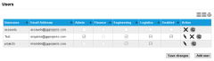

# Configure two-factor authentication

Multi- factor authentication provides an additional layer of security by requiring two independent authentication factors:

1. Enter user credentials in the Login screen.
2. Use a third-party authenticator application to generate a six-digit authentication code. Ensure that you enter this authentication code into the the Login screen before it expires.

Use either of the following authentication applications:

* [Google Authenticator](https://support.google.com/accounts/answer/1066447)
* [Authy](https://authy.com/)
* [LastPass Authenticator](https://lastpass.com/auth/)

In Infinity Classic, two factor authentication must be requested to be enabled for a portfolio. If enabled, all users assigned to that portfolio will require two factor authentication when they log in. The first time they log in after two factor authentication is enabled will trigger an email with instructions to use it.

To log in to Infinity Classic for the first time with two factor authentication:

1. Navigate to the following URL: [https://siam3.eseye.com/user/login/](https://siam3.eseye.com/user/login/)
2. Enter you supplied username and password and select Sign In. After the first successful log in, Infinity Classic emails a QR code and two factor authentication instructions to the user's email address. All subsequent log in attempts will require the following additional step.
3. Specify an authentication code and select Submit. 

To resend the two factor authentication QR code in Infinity Classic:

1. Log in to Infinity Classic as an Admin user.
2. Display the Admin > User menu (shown below). 
3. Next to the user to which to resend the QR code, select the  icon. Infinity Classic emails a QR code and two factor authentication instructions to the user's email address.

## Related tasks

Back to overview
