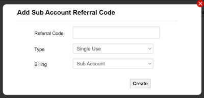
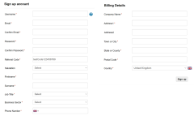

# Create and manage sub-accounts

Sub accounts are created by Infinity Classic users with one or more customers who wish to use Infinity Classic's functionality. SIMs which are moved to a sub account will be separate from those in the parent account, and any other child accounts. Sub accounts can be used to give customers access to a group of SIMs, rather than the entire portfolio.

Account users can log in as sub account users and use the Infinity Classic portal as if they were the sub account user.

### Creating sub accounts

Creating sub accounts involves sending referral codes to new users who can then gain access to Eseye's Infinity Classic portal. The new users will only have access to SIMs allocated to the sub account.

Once created, you can only edit or delete sub accounts by contacting Support.

To create sub accounts in Infinity Classic:

1. Log in to Infinity Classic.
2. Create a referral code as follows:
3. Select Admin > Referral Codes.
4. Select Add Sub Account Referral Code, which displays the following dialog:
5. Specify a unique referral code, at least six characters in length, to send to the user.
6. Specify one of the following referral code types to send to the user:

* Single Use – creates a code for a sub account that can only be used once.
* Perpetual – creates a reusable code for sub accounts.
* Tie – creates a new user on your account.

5. Under Billing, select Sub Account.
6. Select Create.
7. Send the referral code to the sub account user as follows:
8. On the Referral Codes pages page, select the message icon ().
9. Specify one or more email addresses to add to the sub account. Use a comma-separated list for multiple addresses.
10. Select Send Email.
11. Wait for the user to [validate the email](../#ValidateSubAccount).

To log in to a sub account:

1. Log in to Infinity Classic then go to: Admin > Sub Accounts.
2. Select  alongside the relevant sub account.
3. Confirm that you want to log out of your current account. Infinity Classic logs in to the sub account, which has access to the SIMs, Settings, Activity, Admin and Support menus.

To validate a sub account after receiving a referral code:

1. Check for an email from support@eseye.com with the following subject line: Invitation to set up a SIM Management portal account.
2. Open the email and select the link to validate your account. Infinity Classic displays the Sign up account page.  Required fields are indicated by a red star \[\*]. Most fields are free text fields or dropdown menus, the only fields with text rules are:

* Username – must be between 6 and 32 characters in length, and should contain only letters, digits, '-', '\_', or be a valid email address.
* Password – must be between 6 and 32 characters in length, and contain at least one lower case letter, one upper case letter, and a numeric digit.
* Phone number flag – select the flag icon to select the appropriate international code for your phone number.

3. Complete the fields on the Sign up account page, then select Sign up.

## Related tasks

Back to overview
