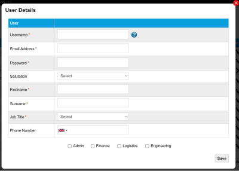

# Create and manage users

User accounts restrict access to Eseye tools and APIs.

## Create and manage users

To create a new Infinity Classic account:

1. Log in to Infinity Classic then go to: Admin > Users.
2. Select Add user.
3. Complete the fields on the User Details dialog.  Fields with an asterix are mandatory.
4. Select one or more credential check boxes: Admin, Finance, Logistics, or Engineering.
5. Select Save. The User Details saves and closes. An automatic email is sent to the new user with the following details:

* From: support@eseye.com
* Subject: Your account on https://siam3.eseye.com/
* Body: Contains an account verification link.

### Related tasks

Back to overview
