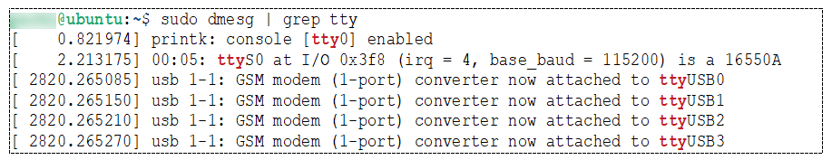

# Upgrading the Quectel module firmware

From time to time, you may need to upgrade your Quectel module firmware.

### Before you begin

You need:

* A Windows computer (version 1909 or later), or up-to-date Linux system, with administrator access.
* The Quectel module where you want to update the firmware.
* The relevant cable with data transfer capability (such as a Micro USB cable) for connecting the Quectel module to the computer. Ensure the cable is connected to the device and the computer.
* For Linux, a [terminal emulator](connecting-to-the-quectel-module-using-a-terminal-emulator.md) (such as PuTTY) to connect to the relevant USB interface, for example: `ttyUSB2`. Use the following serial settings: `115200 8-N-1`.
* If required, a jumper wire to power up the Quectel module, for example if it is part of an LTE IoT 2 click.
* Contact your Account Manager to receive a dropbox link to the Quectel module files. Specify if you require Windows or Linux-based files.

Download and extract the following tools using the supplied link, where <_version_> is the latest version:

When you extract the files, ensure that the subfolders are also extracted.

* For Windows users:
  * Quectel LTE and 5G Windows USB driver – Quectel\_LTE\_5G\_Windows\_USB\_Driver\_V<_version_>.zip
  * QFlash for Windows – QFlash\_V<_version_>\_EN.zip
*   For Linux users:

    * Quectel Linux USB driver – Quectel\_Linux\_USB\_Serial\_Option\_Driver\_V<_version_>.zip
    * QFirehose for Linux – QFirehose\_Linux\_Android\_V<_version_>.zip

    Up-to-date Linux systems support a USB connection to the Quectel module.

You must also download and extract the Quectel module firmware for your specific Quectel module model (the model number is located at the top of the chip) – for example, BG9...zip.

If you are **not** using AnyNet SMARTconnect™, you must request a firmware update for your module from Quectel Support. If you are using AnyNet SMARTconnect™, Eseye will supply you with the firmware file as part of AnyNet SMARTconnect™ installation.

For more information, see:

* BG9x: [Installing AnyNet SMARTconnect™ on a Quectel BGxx module](installing-anynet-smartconnect-tm-on-a-quectel-bgxx-module.md)
* EG2x-G: [Installing AnyNet SMARTconnect™ on a Quectel EG2x-G module](installing-anynet-smartconnect-tm-on-a-quectel-eg2x-g-module.md)

## Installation overview

1. Choose the Windows or Linux installation.
2. Install the required USB drivers so you can use the relevant ports to load the firmware.
3. Using a USB port on your computer, connect your development board that contains the Quectel modem.
4. Discover which ports your computer is using to communicate with the development board.
5. Update the Quectel module firmware using the supplied application.

## Updating the module firmware using Windows

### Installing the Windows USB drivers

To install the Windows USB drivers:

1. In the extracted Quectel\_LTE\_5G\_Windows\_USB\_Driver\_V<_version_> folder, locate and run **setup.exe** to start the InstallShield Wizard.
2. If required, change the destination location, then select Next.
3.  Select Next to copy the files into the specified location and install the drivers.

    Depending on your Windows security, a warning may appear. Select Install.

    The InstallShield Wizard Complete window appears when the drivers are successfully installed.
4. Select Finish to exit the wizard.

### Connecting to the Quectel module

Connect the Quectel module to the computer and power it up.

Depending on your development board, you may need to consult the development board circuit diagram to find the pin that drives the PWR key. For example, use a jumper wire to power up the LTE IoT 2 click, using the PWK and 5V pins.

You need only touch the pins briefly to power up.

Do not disconnect the power supply to the Quectel module at any time. The module requires power at all times, even during sleep mode.

To check the USB DM port number:

1. Using the computer, open Device Manager.
2.  Expand Ports (COM & LPT).

    If Ports (COM & LPT) does not exist, ensure that you have correctly installed the USB drivers, and that the cable can transfer data.
3. Make a note of the Quectel USB DM Port number, which will vary depending on computer and USB port.

### Updating the module firmware

To update the module firmware:

1. In the extracted QFlash\_<_version_>\_EN\_Windows folder, locate and run QFlash\_V<_version_>.exe to launch the application.
2. In the COM Port drop-down list, select the port number that matches the Quectel USB DM Port number.
3. In the Baudrate drop-down list, select an appropriate rate, for example 460800.
4.  Select Load FW Files.

    Load FW Files is a button, not a selection list as the UI implies.
5. In the Open window, browse to the supplied firmware folder, for example BG9x....
6. In the update folder, double-click any \*.mbm file to load the firmware files onto the connected Quectel module.
7. Select Start to upgrade the module firmware.
8.  For BG9x modules only, if the Do you need MBN autosel feature enabled by default? dialog appears, select OK.

    Do NOT select the MBN autosel feature enabled checkbox.
9.  Wait for the firmware upgrade to finish.

    When the process completes, a PASS message should appear in the QFlash\_V<_version_> window.
10. If a FAIL message appears, start the procedure again.

    If the upgrade consistently fails, ensure the DM Port is correct. Alternatively, contact Support.

## Updating the module firmware using Linux

### Connecting to the Quectel module

Connect the Quectel module to the computer and power it up.

Depending on your development board, you may need to consult the development board circuit diagram to find the pin that drives the PWR key. For example, use a jumper wire to power up the LTE IoT 2 click, using the PWK and 5V pins.

You need only touch the pins briefly to power up.

Do not disconnect the power supply to the Quectel module at any time. The module requires power at all times, even during sleep mode.

### Checking the existing Linux USB drivers

Before installing the Linux USB drivers, check which drivers already exist on your Linux system.

To check your existing drivers:

1.  Using the Linux command terminal, enter the command:

    ```
    sudo dmesg | grep tty
    ```

    If Linux correctly recognized the Quectel module, then four USB interfaces are listed in consecutive order, for example:

    

    If less than four USB interfaces exist, you must install the USB drivers.

    The initial two USB interfaces enable you to update the Quectel module firmware using QFirehose, and install AnyNet SMARTconnect™ using QExplorer. The last two USB interfaces enable you to connect to the Quectel module with a terminal emulator in order to send AT commands.

### Installing the USB drivers

To compile and install the USB drivers:

1.  Using the command terminal, enter the command:

    ```
    uname -r
    ```
2. Note your Linux kernel version.
3.  Navigate to the correct extracted subfolder: Quectel\_LTE\_5G\_Linux\_USB\_Driver\_V<_version_>/<_kernelversion_>

    where <_kernelversion_> matches your Linux kernel version.

    If your kernel version does not match the supplied versions, use the nearest previous version. For example, if your kernel version is v5.19.4 and the supplied versions are v5.19.1 and v5.19.5, then use v5.19.1.
4.  Compile and install the drivers by entering:

    ```
    sudo make install
    ```
5. Reboot Linux.
6.  Check if Linux is correctly recognising the Quectel module by entering:

    ```
    sudo dmesg | grep tty
    ```

    The response should contain four USB interfaces, listed in consecutive order.

### Updating the module firmware

To update the module firmware:

1. Using the command terminal, navigate to the extracted Quectel\_LTE\_5G\_QFirehose\_Linux\_Android\_V<_version_> folder.
2.  Compile QFirehose by entering:

    ```
    make
    ```

    If it is successful, you will see the QFirehose file.
3.  Enter the command:

    ```
    sudo ./QFirehose -f <_..._>
    ```

    where <_..._> is the path to the supplied firmware folder, for example BG9....
4. Reboot the Quectel module.
5.  Use a [terminal emulator](connecting-to-the-quectel-module-using-a-terminal-emulator.md) to check the firmware version by sending the following:

    ```
    AT+QGMR
    ```

    The returned version should match the version you installed.

## Where to next?

* [About AnyNet SMARTconnect™](https://app.gitbook.com/s/TZG4LrCHVlGSXoDpMgo3/getting-started/about-anynet-smartconnect-tm)
* Installing AnyNet SMARTconnect™:
  * BG9x: [Installing AnyNet SMARTconnect™ on a Quectel BGxx module](installing-anynet-smartconnect-tm-on-a-quectel-bgxx-module.md)
  * EG2x-G: [Installing AnyNet SMARTconnect™ on a Quectel EG2x-G module](installing-anynet-smartconnect-tm-on-a-quectel-eg2x-g-module.md)
* [Connecting to the cloud](connecting-to-the-cloud.md)
* [Management AT commands](https://app.gitbook.com/s/TZG4LrCHVlGSXoDpMgo3/at-command-reference/management-at-commands)
* +ETM Unsolicited Response Codes (URCs)
* [General AT commands](https://app.gitbook.com/s/TZG4LrCHVlGSXoDpMgo3/at-command-reference/general-at-commands)
* 8618 Eseye-enabled Quectel BG96 module Developer Guide (PDF)
