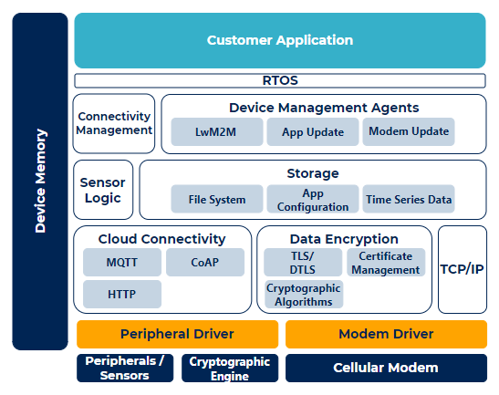
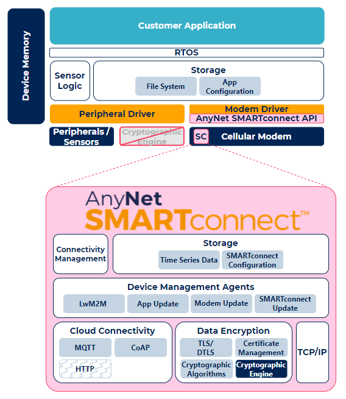

# About AnyNet SMARTconnect™

AnyNet SMARTconnect™ is a suite of software tools that establishes and maintains an IoT device's connection to a cellular network, and simplifies securely connecting the device to cloud services. This includes:

* Persistent storage of published data until connection is established and data delivery completes
* Bi-directional encryption and transportation of data
* End-to-end connection monitoring and active network management between the device and the cloud
* Network performance and reliability measured at the data transport layer
* Simplified over-the-air (OTA) updates to customer software or firmware, the modem firmware, and AnyNet SMARTconnect™
* Seamless migration if you need to change cloud providers


AnyNet SMARTconnect™ supports the MQTT protocol.


Configure the module with the [using-the-anynet-smartconnect-tm-configuration-file.md](getting-started/using-the-anynet-smartconnect-tm-configuration-file.md "mention"). For software and firmware maintenance, see [system-lifecycle-management.md](getting-started/system-lifecycle-management.md "mention").

## Why use AnyNet SMARTconnect™?

AnyNet SMARTconnect™ works with the AnyNet Secure SIM to deliver a secure, highly available, end-to-end monitored data connection for your IoT applications.

AnyNet SMARTconnect™ sits within the cellular modem, reducing the amount of memory and resources required within the device to store and run the following typical functions for secure IoT device connectivity and ongoing management:

| Without AnyNet SMARTconnect™                                   | With AnyNet SMARTconnect™                                     |
| -------------------------------------------------------------- | ------------------------------------------------------------- |
|  |  |

There are multiple advantages to using AnyNet SMARTconnect™:

* Reduced time to market for your IoT devices and lower development costs (including onboarding)
* Reduced complexity for customer IoT device designs
* Reduced resource demands on customer hardware (CPU bandwidth, cryptography and memory)
* Access to Eseye connectivity expertise and code, enabling product developers to focus on the applications and data that deliver business value
* Module independence, providing modularity in design and ability to navigate supply chain issues
* Future-proof IoT investment by enabling connectivity recovery and network swap owing to outages and network deprecation, and thereby avoiding costly site visits
* Access to new networks and operators as the market changes
* Increased manageability, including OTA updates to:
  * Introduce new features
  * Patch the device
  * Enhance security, applications, and artificial intelligence (AI) and machine learning (ML) models

## AnyNet SMARTconnect™ features

### Cellular connection management

* Automatic network selection
* Automatic network establishment
* Connection monitoring and maintenance, which includes:
  * Combined Session, Network and Physical Layer connection monitoring
  * Alternate path selection in conjunction with the AnyNet SIM
  * Proactive intervention to restore network connection
  * Network Friendly Mode operation

### Cloud connection management

* Automatic cloud provider configuration based on service endpoint URL
* MQTT data transport publish and subscribe with up to 8 topics each
* Data storage/queue for MQTT QOS 1 messages, including:
  * Configurable ON /OFF to allow host to queue
  * Data persisted over power cycle and network re-establishment
  * Data queued until MQTT ACK (acknowledgement) received, or persistent error
  * Automatically delivered or queued subscribed data
  * Auto-connect mode for configured single publish/subscribe topic solutions

### Data encryption

* Transport Layer Security (TLS) encryption offload, data is encrypted on the module
* Certificate storage on the module
* AnyNet Secure enabled OTA certificate installation and update
* Post-build and deployment certificate provisioning

### Simplified OTA updates

* Customer application updates
* Cellular module firmware updates
* AnyNet SMARTconnect™ updates
* AnyNet SMARTconnect™ configuration updates

### System interface

* Standard URC support (interrupt mode)
* Non-Interrupt (Polled) mode data receive and status notification support
* Configurable input/output for interrupt/wakeup signal

## About AnyNet SMARTconnect™ formats

Eseye can provide AnyNet SMARTconnect™ in any of the following formats:

* An application running on a cellular module
* A library running on a microprocessor
* A pre-compiled binary running on an embedded operating system, such as openWRT Linux
