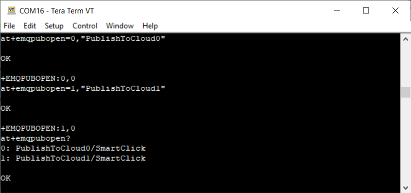
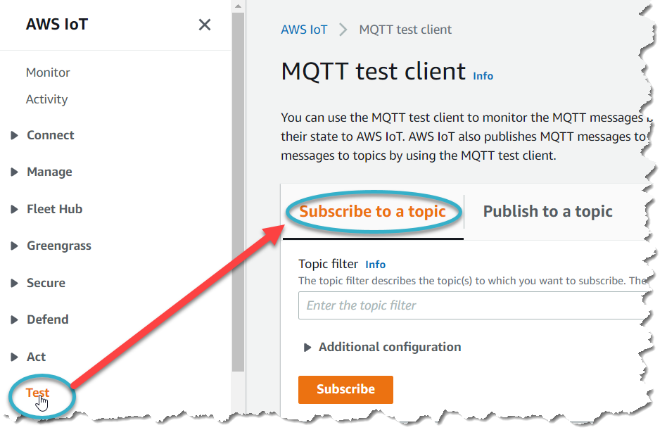
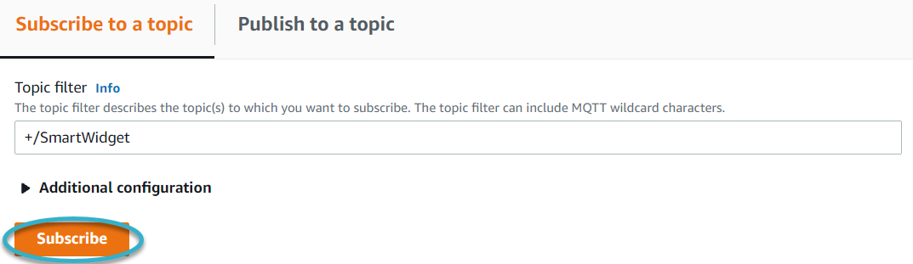
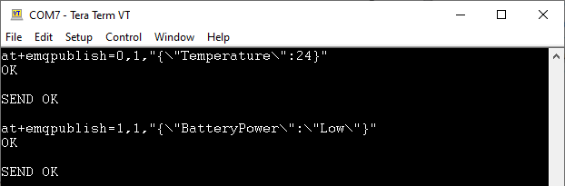
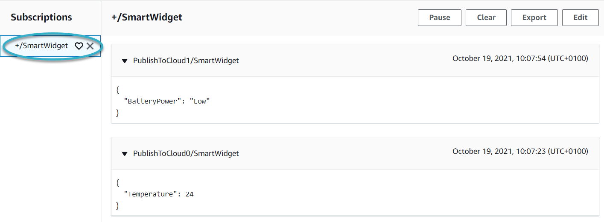

# Sending and receiving data

### Before you begin

*   Using a terminal emulator, send an AT command to ensure that the smart terminal can receive AT commands. For more information, see [general-at-commands](../at-command-reference/general-at-commands/ "mention").

    For information about connecting a terminal emulator to the modem, see Connecting to the LTE IoT 2 click.
*   Send an AT+ETMINFO=version command to verify that the version number is AnyNet SMARTconnect™ V0.99\_ma or higher.

    If the version number is not in this range, you will need to update the modem software. For more information, see [over-the-air-ota-updates.md](../updates/over-the-air-ota-updates.md "mention").
* Send an AT+ETMSTATE="startmqtt" command to enable the MQTT protocol
* Ensure you know the thing name that you set up in the cloud.

The example below uses AWS. The current AWS interface may differ slightly from the one we used in the example.

To test that your thing can publish information to the cloud:

1. Create two publish topics in the module.
   1.  Using a terminal emulator, type:

       at+emqpubopen=0,"PublishToCloud0"

       at+emqpubopen=1,"PublishToCloud1"
   2.  Check that the first two index numbers are assigned a topic each. Type:

       at+emqpubopen?

       A list of index numbers and their assigned topics appears.

       
2. Subscribe to the newly created publish topics using your cloud provider's console.
   1.  UsingAWS IoT, in the left hand menu, select Test to open the MQTT test client, then ensure you are on the Subscribe to a topic tab.

       
   2.  In the Topic filter box, type:

       +/<_ThingName_>

       This subscribes AWS to all topics related to your thing.
   3.  Select Subscribe.

       

       A subscription appears, listed in the Subscriptions panel.
3.  Publish information to the topics you created in the module.

    You can send a maximum payload of 1000 characters to AWS.

    1.  Using the terminal emulator, type:

        at+emqpublish=0,1,"{"Temperature": 24}"

        at+emqpublish=1,1,"{"BatteryPower": "Low"}"

        The emqpublish command uses the following syntax:

        at+emqpublish=_IndexNumber_,_QoS_,

        "{_PublishDataInJSON_}"

        

        These messages instantly appear in the cloud.
4. View the published information in the cloud.
   1.  In the Subscriptions panel, select +/<_thingName_> to view all published messages.

       

If you can see the messages in the cloud, then your thing can successfully publish data into the cloud through the module.

Next, test that the cloud can publish messages to your thing.
