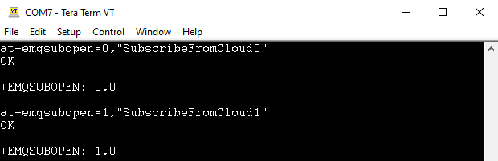
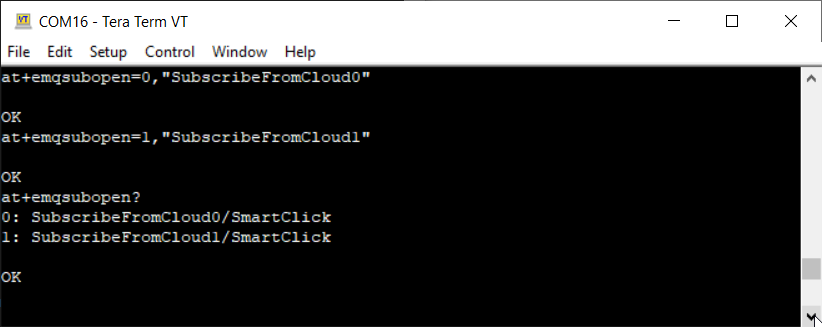
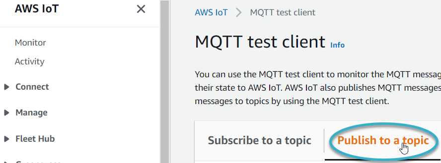
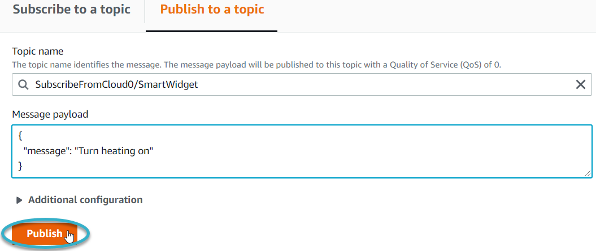
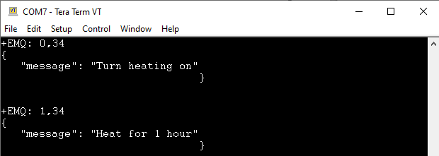

# Sending data from the cloud to your thing

### Before you begin

Ensure your thing can send information to the cloud.

For more information, see [sending-and-receiving-data.md](sending-and-receiving-data.md "mention").

The example below uses AWS. The current AWS interface may differ slightly from the one we used in the example.

To test that the cloud can publish information to your thing:

1. Create two subscribe topics in the module.
   1.  Using a terminal emulator, type:

       at+emqsubopen=0,"SubscribeFromCloud0"

       at+emqsubopen=1,"SubscribeFromCloud1"

       
   2.  Check that the first two index numbers are assigned a topic each. Type:

       at+emqsubopen?

       A list of index numbers and their assigned topics appears.

       
2. Use the cloud to publish a message to each topic.
   1.  Using the AWS IoT MQTT test client, select the Publish to a topic tab.

       
   2.  In the Topic name box, type:

       SubscribeFromCloud0/<_cloudThingName_>
   3.  In the coding window, replace

       Hello from AWS IoT console with

       Turn heating on
   4.  Select Publish.

       
   5.  In the Publish box, type:

       SubscribeFromCloud1/_cloudThingName_
   6.  In the coding window, replace

       Turn heating on with

       Heat for 1 hour
   7.  Select Publish.

       View the AWS messages in the terminal emulator, in the following format:

       +EMQ: <_indexnumber_>,<_messagelength_>

       {

       "message": "<_messagetext_>"

       }

       

If you can see the messages in the terminal emulator, then the cloud can successfully publish data to your thing through the module.
